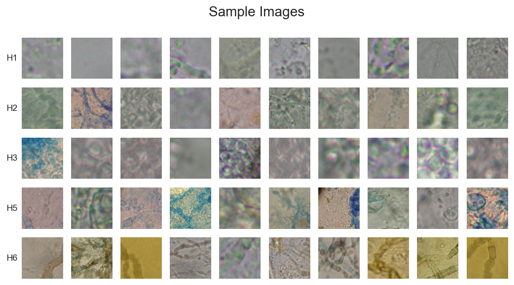
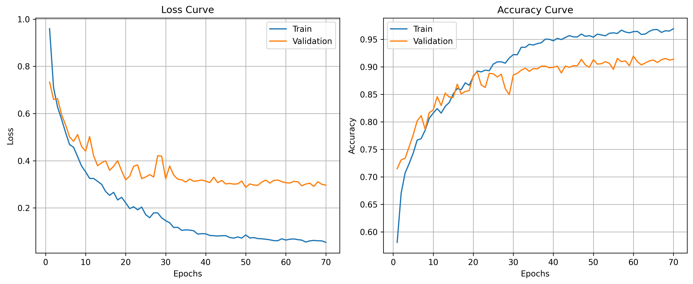
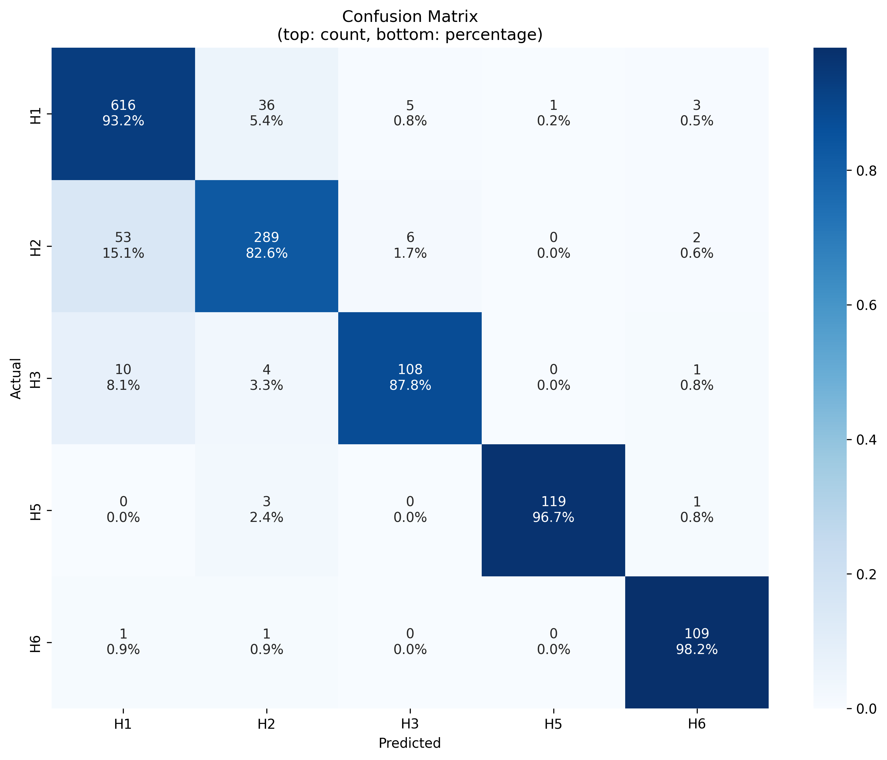
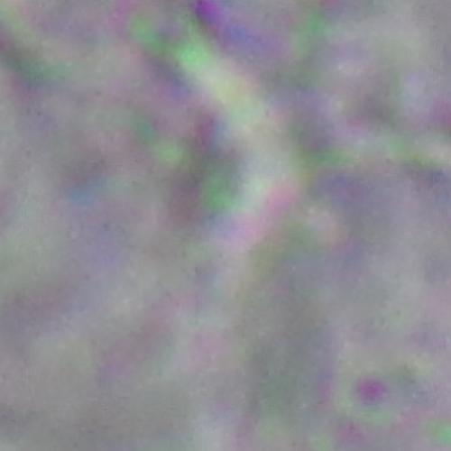

# Fungi Image Classification

An end to end deep learning system for classifying fungi images using **EfficientNet** with a fully modular pipeline for **training**, **evaluation**, and **inference** (**PyTorch** + **ONNX**).


## Overview

This project builds an image classification system to identify fungi species from images.

The pipeline includes:
- Dataset preparation from raw images
- Training EfficientNet-based models with transfer learning
- Evaluation with confusion matrix and class-wise metrics
- Inference pipelines in both **PyTorch** and **ONNX**

## Dataset
- **Source** : https://archive.ics.uci.edu/static/public/773/defungi.zip
- **Total instances** : 9114
- **Number of classes** : 5 

### Classes :
  - H1 - Tortuous septate hyaline hyphae (TSH)
  - H2 - Beaded arthroconidial septate hyaline hyphae (BASH)
  - H3 - Groups or mosaics of arthroconidia (GMA)
  - H5 - Septate hyaline hyphae with chlamydioconidia (SHC) 
  - H6 - Broad brown hyphae (BBH)


### Sample Images 



Each row corresponds to a class.


## Model Architecture 
- Backbone: **EfficientNet V2-S** (pretrained)
- Transfer learning with:
    - Frozen backbone
    - Selective unfreezing (last layers)
- Custom classifier head:
    - Fully connected layers with BatchNorm and Dropout

## Experiments
Different fine-tuning strategies were explored using a pretrained `EfficientNetV2-S` backbone:
- `head_64`, `head_256_64`: Backbone frozen, only classifier trained
- `last1_64`: Unfreeze last block of backbone
- `last2_64`: Unfreeze last two blocks for deeper adaptation

In initial experiments, `last2_64` performed best, as it allowed the model to adapt higher level features while retaining pretrained representations. <br>
This configuration was selected and trained for more epochs.

## Features 
- Modular pipeline
    - `training`, `evaluation`, `inference` separated cleanly
- ONNX support
    - Export and run inference without PyTorch
- Class imbalance handling
    - Weighted loss using class distribution


## Results
The model was evaluated on a held out test set.
- **Overall Accuracy:** 90.7%

### Training Curves 


Model converges smoothly with slight overfitting.

### Confusion Matrix 


Most misclassifications occur between H1, H2, H3. H5 and H6 show strong separation.

## Project Structure

```text
fungi-image-classification/
|
├── assets/
|
├── data/
│   ├── train/
│   ├── valid/
│   └── test/
|
├── training_runs/                  # Contains models
│   └── <experiment_name>/
│       ├── <experiment_name>_best.pth
│       ├── <experiment_name>_history.json
│       ├── <experiment_name>_best.onnx
│       ├── <experiment_name>_best.onnx.data
│       ├── <experiment_name>_best_metadata_onnx.json
│       └── evaluation/
|
├── src/
│   │
│   ├── config.py
│   │
│   ├── data/
│   │   ├── download.py
│   │   ├── dataset.py
│   │   └── dataloader.py
│   │
│   ├── model/
│   │   └── model_utils.py
│   │
│   ├── training/
│   │   ├── train_utils.py
│   │   └── evaluate_utils.py
│   │
│   ├── utils/
│   │   ├── device.py
│   │   ├── image_utils.py
│   │   ├── eda_utils.py
│   │   └── logging.py
│   │
│   ├── inference/
│   │   ├── preprocess.py
│   │   └── inference_utils.py
│   │
│   └── scripts/
│       ├── prepare_data.py
│       ├── train.py
│       ├── evaluate.py
│       ├── infer.py
│       ├── export_onnx.py
│       └── infer_onnx.py
|
└── notebooks/
    └── notebook.ipynb

```

## Tech Stack

### Machine Learning & Deep Learning
-   PyTorch
-   Scikit-learn
-   Torchvision (EfficientNet)

### Deployment
-   ONNX

### Backend
-   FastAPI
-   Docker 

### Infrastructure
-   AWS EC2
-   Vercel

## Setup

### Install dependencies
```sh
pip install -r requirements.txt
```

## Usage 

### 1. Prepare Dataset 
```sh
python src/scripts/prepare_data.py 
```
Arguments ( `dataset-url`, `raw_dir`, `data_dir` ) can be configured via CLI, with defaults already provided.

### 2. Train Model
```sh
python src/scripts/train.py --model_name run_v1 --epochs 10
```
Other parameters such as experiment type, learning rates, and patience can also be adjusted via CLI arguments. Defaults are already specified.

### 3. Evaluate Model 
```sh
python src/scripts/evaluate.py --model_dir training_runs/run_v1
```
Outputs:
- Confusion matrix
- Class metrics
- Loss curves

### 4. PyTorch Inference 
```sh
python src/scripts/infer.py --model_path training_runs/run_v1/run_v1_best.pth --image_path data/test/H2/H2_1a_3.jpg --top_k 5
```

### 5. Export to ONNX 
```sh
python src/scripts/export_onnx.py --model_path training_runs/run_v1/run_v1_best.pth
```

### 6. ONNX Inference
```sh
python src/scripts/infer_onnx.py --onnx_path training_runs/run_v1/run_v1_best.onnx --metadata_path training_runs/run_v1/run_v1_best_metadata_onnx.json --image_path data/test/H3/H3_3b_2.jpg --top_k 5
```

This repository focused on model development and inference pipelines. <br>
Backend API and frontend are maintained separately.

### Backend ─ Projects Hub

https://github.com/mandeepsingh7/projects-hub

- Centralized backend for all ML/AI projects 
- Contains FastAPI endpoints for multiple projects, including the Fungi Image Classification system
- Handles :
  - Inference pipelines
  - Routing 

**Deployment:** AWS EC2

### Frontend ─ Portfolio

https://github.com/mandeepsingh7/portfolio

- Unified frontend for all projects
- Provides UI to interact with different APIs from Projects Hub 
- Handles :
  - User Interface 
  - API Integration 

**Deployment:** Vercel 

## API Example

### Get Random Sample

**Endpoint**

```
GET /fungi-image-classification/random-sample
```

**Response**
```json
{
  "image_url": "fungi-image-classification/sample-image/H1/H1_2b_12.jpg",
  "true_label": "H1"
}
```

### Get Sample Image

**Endpoint**

```
GET /fungi-image-classification/sample-image/{label}/{image_name}
```

**Example**

```
GET /fungi-image-classification/sample-image/H1/H1_2b_12.jpg
```

**Response**
- `200 OK`
- `content-type: image/jpeg`
- Returns a binary JPEG image stream

**Image Returned**



### Predict Fungi Class

**Endpoint**

```
POST /fungi-image-classification/predict/?top_k=3
```
**Request**
```sh
curl -X 'POST' \
  'https://api.mandeeps.in/fungi-image-classification/predict/?top_k=3' \
  -H 'accept: application/json' \
  -H 'Content-Type: multipart/form-data' \
  -F 'file=@H2_3a_6.jpg;type=image/jpeg'
```

**Response**
```json
{
  "predictions": [
    {
      "class": "H2",
      "probability": 0.9984840750694275
    },
    {
      "class": "H1",
      "probability": 0.0015108127845451236
    },
    {
      "class": "H6",
      "probability": 0.000002102401367665152
    }
  ]
}
```

## Demo

Accessible through the portfolio:

https://mandeeps.in